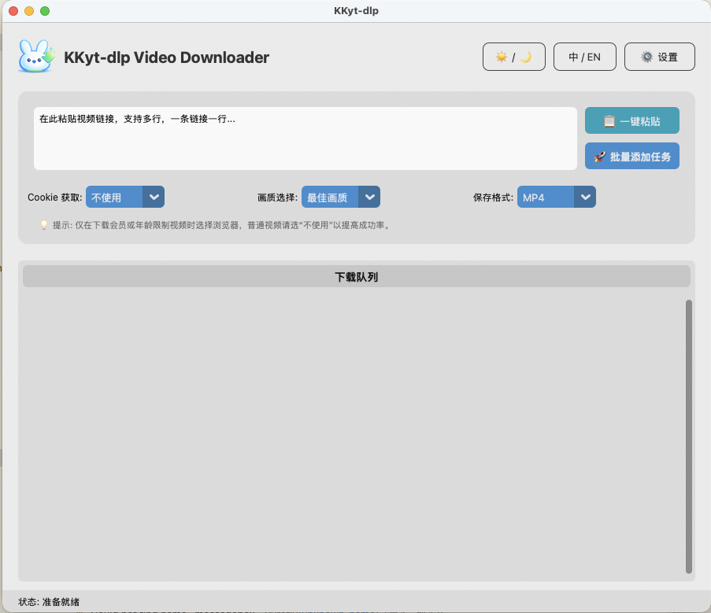

<div align="center">
  
  <h1>KKyt-dlp</h1>
  <p>一个基于 yt-dlp 和 CustomTkinter 的极简、跨平台高清视频下载工具。</p>

  [](LICENSE)
  [](README.md)
  [](requirements.txt)
</div>

---

## 🌟 项目简介

**KKyt-dlp** 旨在为普通用户提供最纯粹的视频下载体验。它屏蔽了命令行复杂的参数，将强大的 `yt-dlp` 内核包装在现代化、简洁直观的图形界面（GUI）中。

### V1.6 全新特性 ✨
- **🌓 明暗主题适配**：新增明亮/黑暗主题一键切换支持。
- **🌐 多语言支持**：新增中/英文语言一键无缝切换功能。
- **🚀 增强的批量下载**：地址栏现已更新，支持通过多次或者批量粘贴地址，实现一键添加多行任务并自动并发下载。

### 核心特性
- **🚀 极速下载**：基于业界顶尖的 `yt-dlp` 内核，支持多线程加速。
- **🎨 简洁 UI**：采用 `CustomTkinter` 设计，界面清爽，操作零门槛。
- **🛡️ 纯净安全**：无广告、无多余进程、所有下载逻辑直接与官网交互。
- **💻 跨平台适配**：针对 Windows 的 CMD 窗口和 macOS 的 Tcl/Tk 崩溃问题均进行了专项深度优化。
- **🔧 智能内核管理**：内置 `n-challenge` 签名挑战解决方案（QuickJS），有效避免“格式不可用”报错。
- **📺 广泛支持**：理论支持全球 **1000+** 主流视频网站（Youtube, Bilibili, TikTok, Twitter 等）。[查看完整列表](https://github.com/yt-dlp/yt-dlp/blob/master/supportedsites.md)

---

## 📸 界面预览


*(注: V1.6 更新了全新的高质量程序静态图片与多语言 UI 细节)*

---

## 📥 安装与运行

### 对于普通用户
- **Windows**: 下载发行版的 ZIP 解压后，直接运行 `KKyt-dlp.exe`。
- **macOS**: 下载发行版的 `.dmg` 安装镜像，双击挂载后将其拖入 `Applications` (应用程序) 文件夹即可使用。
  - *注意：首次打开可能需要右键点击选择“打开”或前往“系统设置 -> 隐私与安全性”允许未签名应用运行。*

### 对于开发者 (本地运行)
1. 克隆仓库：
   ```bash
   git clone https://github.com/YourUsername/KKyt-dlp.git
   cd KKyt-dlp
   ```
2. 安装依赖：
   ```bash
   pip install -r requirements.txt
   ```
3. 初始化二进制内核 (ffmpeg/yt-dlp/qjs)：
   ```bash
   python setup_binaries.py
   ```
4. 启动程序：
   ```bash
   python main.py
   ```

---

## 🛠️ 打包指南

项目已预配置好双端打包脚本与 Action自动化部署：

- **Windows**: GitHub Actions 已配置自动化打包，只需提交代码到 `main` 分支即可自动构建 exe。
- **macOS**: 建议使用仓库内配置好的 `build_macos.sh` 一键构建，它会自动下载独立 Python 环境并在 `dist` 生成完美的 `.dmg` 安装镜像。

---

## 🛠️ 常见问题排查 (Windows 端)

如果您在 Windows 上遇到下载失败（尤其是 YouTube），通常是由以下原因导致的：

1.  **Cookie 数据库锁定**：Windows 上的 Chrome/Edge 会在浏览器运行时锁定数据库，导致程序无法直接提取 Cookie。
2.  **机器人检测**：YouTube 对 Windows 的反爬虫检测比 macOS 更为严格。

**💡 解决方案**：
- 建议通过浏览器插件（如 *Get cookies.txt LOCALLY*）导出 `cookies.txt`。
- 在软件右上角的 **设置** 中点击 **“导入 cookies.txt”**。这是目前解决“无法解析格式”或“登录验证”报错最稳妥、最彻底的方法。

---

## 📜 开源协议

本项目基于 [MIT License](LICENSE) 协议开源。请务必遵守当地法律法规，仅限用于个人学习研究。

## 🙏 特别感谢

- [yt-dlp](https://github.com/yt-dlp/yt-dlp) - 强大的下载内核
- [CustomTkinter](https://github.com/TomSchimansky/CustomTkinter) - 现代化的 UI 框架
